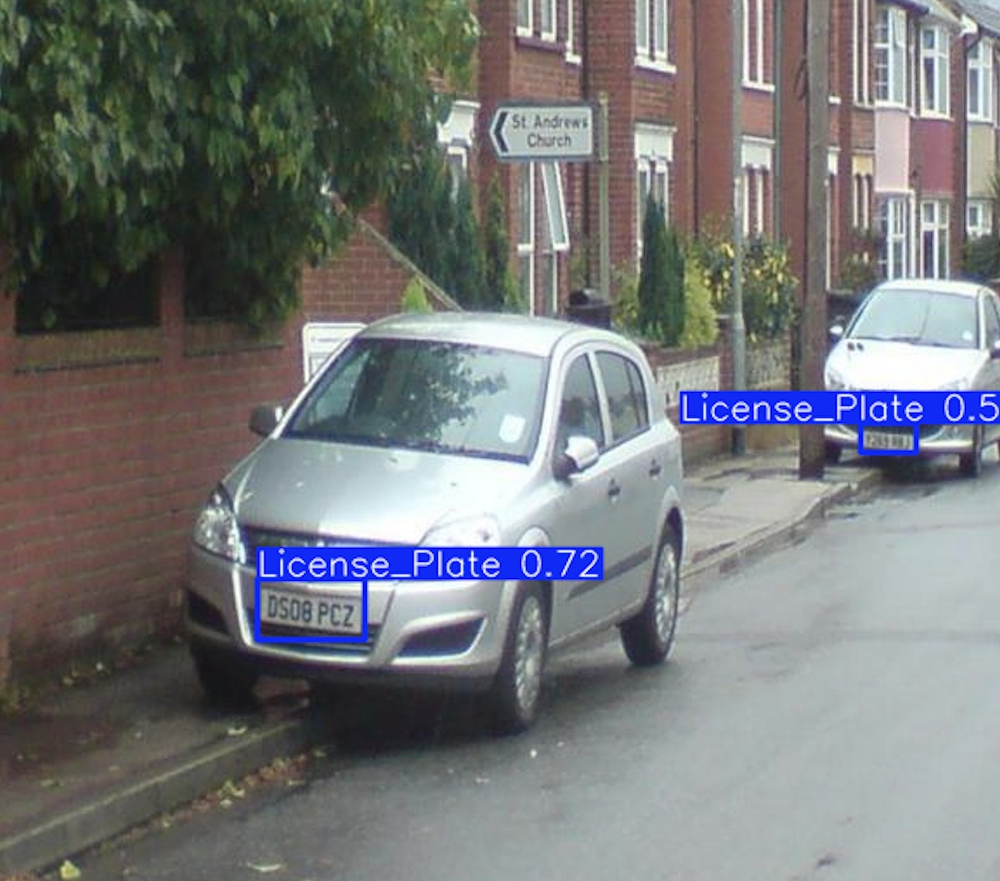
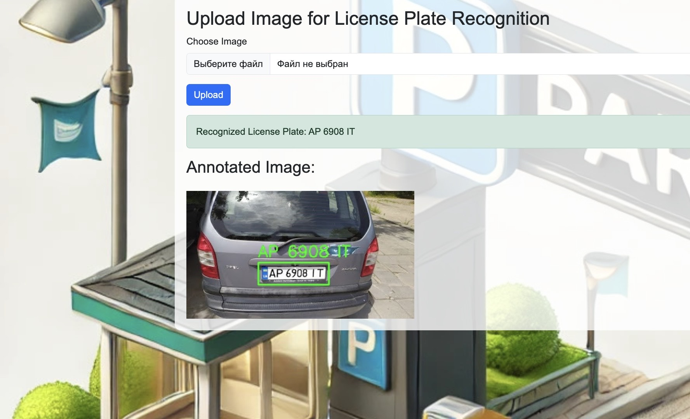
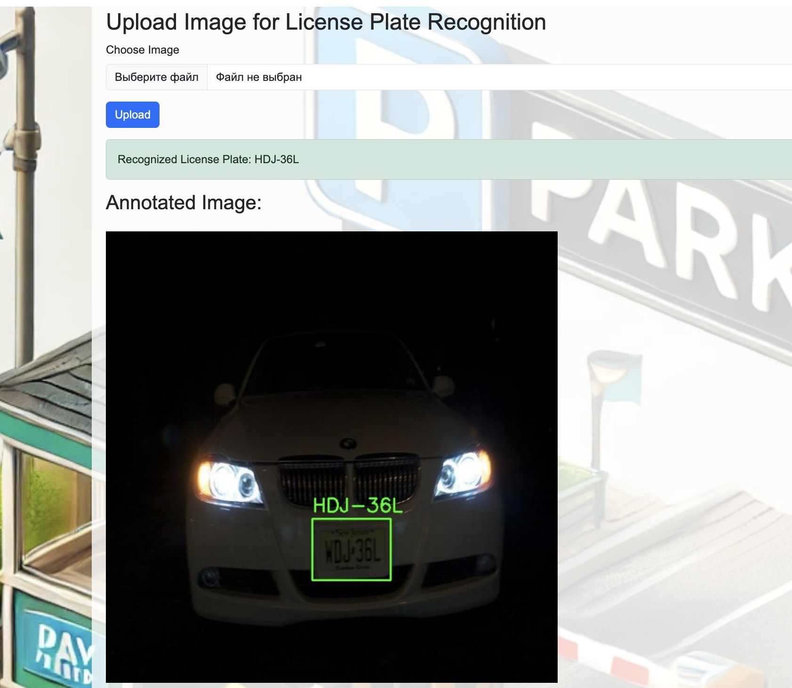

# Parking Management System

## Опис

# Система управління паркуванням

Цей проект є системою управління паркуванням, яка дозволяє автоматично визначати номера автомобільних знаків на зображеннях, відстежувати тривалість паркування для кожного унікального транспортного засобу та розраховувати накопичені паркувальні витрати. Система включає функції управління обліковими записами користувачів, можливість додавання та видалення транспортних засобів, а також генерацію звітів про паркування.

## Технології розпізнавання номерних знаків

Для ефективного визначення та розпізнавання номерів автомобільних знаків у нашому проекті використовуються передові технології комп'ютерного зору:

1. **Детекція номерних знаків**: Для виявлення розташування номерних знаків на зображеннях використовується модель YOLOv8s (You Only Look Once version 8 small). Ця модель забезпечує швидке та точне визначення області, де знаходиться номерний знак на фотографії автомобіля.



2. **Розпізнавання тексту номера**: Після виявлення номерного знаку, для розпізнавання самого тексту номера використовується PaddleOCR. Ця потужна бібліотека оптичного розпізнавання символів (OCR) дозволяє точно зчитувати текст з виділеної області номерного знаку.



Поєднання цих двох технологій забезпечує високу точність та ефективність у процесі автоматичного визначення номерів автомобілів, що є ключовим компонентом нашої системи управління паркуванням.




## Функціональність

- **Управління користувачами**: Адміністратор може додавати або видаляти користувачів, блокувати транспортні засоби.
- **Розпізнавання номерних знаків**: Система використовує комп'ютерний зір для автоматичного розпізнавання номерів транспортних засобів.
- **Відстеження часу паркування**: Автоматичний підрахунок часу паркування для кожного транспортного засобу.
- **Розрахунок вартості паркування**: Система розраховує вартість паркування на основі типу транспортного засобу.
- **Генерація звітів**: Можливість експорту звітів у форматі CSV для адміністратора.

## Вимоги

- Python 3.11 або вище
- Django 3.5 або вище
- PostgreSQL
- PaddlePaddle (для розпізнавання номерних знаків)
- Інші залежності вказані у файлі `pyproject.toml` або `requirements.txt`

# Налаштування застосунку

## Встановлення віртуального середовища


### 1. Встановлення через Docker
Цей проект можна легко налаштувати за допомогою Docker. Виконайте наступні кроки, щоб запустити додаток:

   - 1. **Переконайтеся, що у вас встановлені Docker та Docker Compose на вашій системі.**
   - 2. **Клонування репозиторію**

      ```git clone https://github.com/your-username/your-repo-name.git```
      ```cd``` your-repo-name

   - 3. **Збірка та запуск Docker-контейнерів**

      ```docker-compose up --build -d```


### 2. Встановлення через Conda

   - 1. **Клонування репозиторію**

      ```git clone https://alona7777.github.io/Final_project/```
      ```cd``` your-repo-name


   - 2. **Створення та активація віртуального середовища**

      Використовуючи Conda:

      - ```conda create -n parking-system python=3.11```
      - ```conda activate parking-system```
      - ```pip install -r requirements.txt```


### 3. Встановлення через Poetry
   - 1. **Встановлення Poetry (якщо ще не встановлений)**

      - На системах Linux і macOS:

      ```curl -sSL https://install.python-poetry.org | python3 -```

      -  На Windows:

      ```Invoke-WebRequest -Uri https://install.python-poetry.org -UseBasicParsing).Content | python -```

      - Додайте Poetry до вашого PATH:

      ```export PATH="$HOME/.local/bin:$PATH"```

   - 2. **Клонування репозиторію**

      - ```git clone https://github.com/yourusername/parking-management-system.git```
      - ```cd parking-management-system```

   - 3. **Встановлення залежностей через Poetry**

      ```poetry install```

   - 4. **Активація віртуального середовища**

      ```poetry shell```


### 4. Встановлення через VENV

   - 1. ```python3 -m venv venv```
   - 2. ```source venv/bin/activate```
   - 3. ```pip install -r requirements.txt```


### Додаткові інструкції для Linux

   - 1. Переконайтеся, що у вас встановлені всі необхідні пакети для компіляції Python-залежностей:
      - ```sudo apt-get update```
      - ```sudo apt-get install build-essential libssl-dev libffi-dev python3-dev```


## Налаштування бази даних:

1. Використовуючи ```example.env``` зробіть власний  ```.env ```

2. Використовуйте psql для створення бази даних PostgreSQL та користувача.

3. Після встановлення залежностей виконайте міграції бази даних:

   - ```python manage.py makemigrations```
   - ```python manage.py migrate```

3. Створення суперкористувача

   - ```python manage.py createsuperuser```


### Запуск сервера

1.  Перейдіть у діректорію ```parking_system```:  

    ```cd``` та ваш шлях до діректорії ```parking_system```

2. Виконайте запуск сервера: 

   - ```python manage.py runserver```


### Використання

##  Авторизація

- Перейдіть за адресою http://127.0.0.1:8000/admin/ і увійдіть під обліковим записом суперкористувача, створеним на етапі налаштування.

- Управління користувачами та транспортними засобами

- Додавайте нових користувачів і транспортні засоби через адмін-панель.

- Завантаження зображень для розпізнавання номерів

- Користувачі можуть завантажувати зображення своїх транспортних засобів, і система автоматично розпізнає номерний знак та обчислить час паркування.

- Генерація звітів

- Адміністратор може згенерувати звіт про паркування та завантажувати його у форматі CSV через відповідний інтерфейс.


@@@@@@@@@@@@@@@@@@@@@@@@@@@@@@@@@@@@@@@@@@@@@@@@@@@@@@@@@@@@@@@@@@@@@@@@@@@@@@@@@@@@@@@@@@@@@@@@@@@@@@@@@@@@@@@@@@@@@@@@

### Інструкція з використання
##  Додавання нового транспортного засобу

- Перейдіть на сторінку додавання транспортного засобу.
- Заповніть форму, вибравши тип транспортного засобу зі списку (Car, Truck, Motorcycle, Yacht).
- Збережіть транспортний засіб.
- Перегляд паркувальних сесій

- Авторизовані користувачі можуть переглядати свої паркувальні сесії.
- Адміністратор може переглядати всі паркувальні сесії.
- Експорт звітів у CSV

- Адміністратор може згенерувати звіт про паркування за певний період і експортувати його у форматі CSV.

@@@@@@@@@@@@@@@@@@@@@@@@@@@@@@@@@@@@@@@@@@@@@@@@@@@@@@@@@@@@@@@@@@@@@@@@@@@@@@@@@@@@@@@@@@@@@@@@@@@@@@@@@@@@@@@@@@@


### Поширені проблеми
- Проблеми з базою даних: Переконайтеся, що налаштування підключення до бази даних правильні, і база даних запущена.